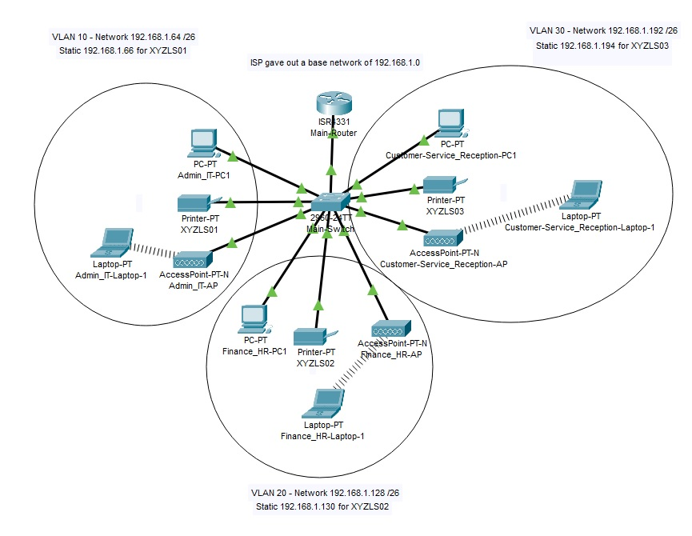
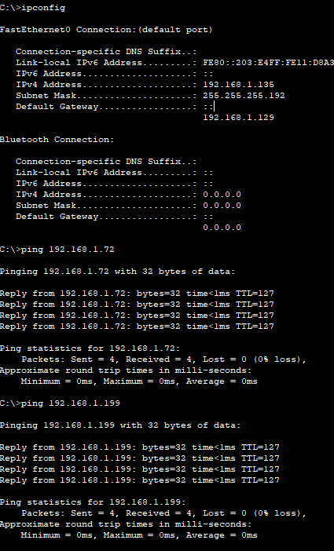
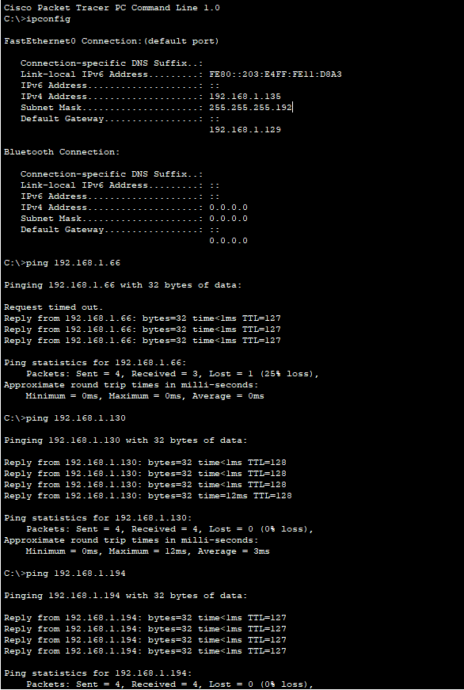

# 🖧 CCNA Network Lab: SOHO Branch – XYZ Company
**Design and Implementation of a Small Office Home Office Network – Project #2**

## 📝 Project Description
Design a network in Cisco Packet Tracer for XYZ Company’s new branch in Bonalbo, Eastern Australia, with the following requirements:

- Single-branch network operating separately from HQ.
- Three departments: Admin/IT, Finance/HR, and Customer Service/Reception.
- Each department should have its own VLAN and wireless network.
- All PCs and wireless devices obtain IP addresses via DHCP.
- Printers are assigned static IP addresses outside DHCP pools.
- Devices in all departments should communicate via inter-VLAN routing.
- Base network: `192.168.1.0/24`.

## 🗺️ Topology
- 3 departments: Admin/IT, Finance/HR, Customer Service/Reception
- Each department has PCs connected to a switch
- Wireless Access Points for each department
- Main-Router connects all VLANs via router-on-a-stick

## 📡 IP Addressing

| Device              | Interface/PC                     | IP Address       | Subnet Mask     | Default Gateway |
|--------------------|---------------------------------|-----------------|----------------|----------------|
| Main-Router         | G0/0/1.10 (VLAN10 – Admin)      | 192.168.1.65    | 255.255.255.192 | -              |
| Main-Router         | G0/0/1.20 (VLAN20 – Finance)    | 192.168.1.129   | 255.255.255.192 | -              |
| Main-Router         | G0/0/1.30 (VLAN30 – Customer)   | 192.168.1.193   | 255.255.255.192 | -              |
| Admin-PC1           | Fa0/1                            | DHCP            | 255.255.255.192 | 192.168.1.65   |
| XYZLS01             | Fa0/2                            | 192.168.1.66    | 255.255.255.192 | 192.168.1.65   |
| Admin-AccessPoint   | Fa0/3 (SSID: EMP_WIFI_1)        | -               | -               | 192.168.1.65   |
| Finance-PC1         | Fa0/4                            | DHCP            | 255.255.255.192 | 192.168.1.129  |
| XYZLS02             | Fa0/5                            | 192.168.1.130   | 255.255.255.192 | 192.168.1.129  |
| Finance-AccessPoint | Fa0/6 (SSID: EMP_WIFI_2)        | -               | -               | 192.168.1.129  |
| Customer-AccessPoint| Fa0/7 (SSID: EMP_WIFI_3)        | -               | -               | 192.168.1.193  |
| XYZLS03             | Fa0/8                            | 192.168.1.194   | 255.255.255.192 | 192.168.1.193  |
| Customer-PC1        | Fa0/9                            | DHCP            | 255.255.255.192 | 192.168.1.193  |
| Admin-Laptop 1      | Wireless (connected to EMP_WIFI_1) | DHCP          | 255.255.255.192 | 192.168.1.65   |
| Finance-Laptop 1    | Wireless (connected to EMP_WIFI_2) | DHCP          | 255.255.255.192 | 192.168.1.129  |
| Customer-Laptop 1   | Wireless (connected to EMP_WIFI_3) | DHCP          | 255.255.255.192 | 192.168.1.193  |

## 🛠️ Technologies Implemented
- Router-on-a-stick for inter-VLAN routing
- Creating VLANs and assigning switch ports
- Configuring DHCP pools and excluded addresses for static devices
- Configuring wireless access points for each department
- Static IP assignment for printers
- Port-security with sticky MACs
- BPDU Guard and PortFast on access ports
- Subnetting and IP Addressing
- Testing and Verifying Network Communication

## ✅ Test Results
- All PCs in Admin/IT can ping each other ✅
- All PCs in Finance/HR can ping each other ✅
- All PCs in Customer Service/Reception can ping each other ✅
- Inter-VLAN communication between all departments via Main-Router ✅
- Printers are reachable from all departments ✅
- Wireless clients successfully obtain DHCP addresses ✅

## 🧪 Testing & Verification

Verify VLAN assignments on the switch:   

Main-Switch#show vlan brief

| VLAN  | Name                          | Status  | Ports                                                                 |
|-------|-------------------------------|---------|-----------------------------------------------------------------------|
| 1     | default                        | active  |                                                                       |
| 10    | Admin_IT                       | active  | Fa0/1, Fa0/2, Fa0/3                                                   |
| 20    | Finance_HR                     | active  | Fa0/4, Fa0/5, Fa0/6                                                   |
| 30    | Customer-Service_Reception     | active  | Fa0/7, Fa0/8, Fa0/9                                                   |
| 998   | Native                         | active  |                                                                       |
| 999   | Parking_Lot                    | active  | Fa0/10, Fa0/11, Fa0/12, Fa0/13, Fa0/14, Fa0/15, Fa0/16, Fa0/17,      |
|       |                               |         | Fa0/18, Fa0/19, Fa0/20, Fa0/21, Fa0/22, Fa0/23, Fa0/24, Gig0/2       |
| 1002  | fddi-default                   | active  |                                                                       |
| 1003  | token-ring-default             | active  |                                                                       |
| 1004  | fddinet-default                | active  |                                                                       |
| 1005  | trnet-default                  | active  |                                                                       |

Verify DHCP bindings on the router:

Main-Router#show ip dhcp binding 

| IP Address     | Client-ID / Hardware Address | Lease Expiration | Type      |
|----------------|-----------------------------|-----------------|-----------|
| 192.168.1.71   | 000B.BED2.BE00              | --              | Automatic |
| 192.168.1.72   | 000A.F3D6.45C3              | --              | Automatic |
| 192.168.1.134  | 0002.161D.AAD6              | --              | Automatic |
| 192.168.1.135  | 0003.E411.D8A3              | --              | Automatic |
| 192.168.1.198  | 0000.0C76.9844              | --              | Automatic |
| 192.168.1.199  | 0001.9619.3A87              | --              | Automatic |

Test inter-VLAN connectivity: ping 

Verify connectivity to static devices (printers): 

Confirm routing between VLANs on the router: 

Main-Router>show ip route

| Code | Network              | Mask             | Next Hop / Interface                  |
|------|--------------------|-----------------|--------------------------------------|
| -    | 192.168.1.0/24      | variably subnetted, 6 subnets, 2 masks | - |
| C    | 192.168.1.64/26     | 255.255.255.192 | directly connected, G0/0/1.10       |
| L    | 192.168.1.65/32     | 255.255.255.255 | directly connected, G0/0/1.10       |
| C    | 192.168.1.128/26    | 255.255.255.192 | directly connected, G0/0/1.20       |
| L    | 192.168.1.129/32    | 255.255.255.255 | directly connected, G0/0/1.20       |
| C    | 192.168.1.192/26    | 255.255.255.192 | directly connected, G0/0/1.30       |
| L    | 192.168.1.193/32    | 255.255.255.255 | directly connected, G0/0/1.30       |

## 📁 Files in this Repository
- `Configs` – Router and Switch Configs  
- `Diagrams` – Network Diagrams  
- `Images` – Ping Tests
- `PKT` – Packet Tracer Project File  

## Author
**Ryan** – Network Engineer Aspirant / CCNA Prep
